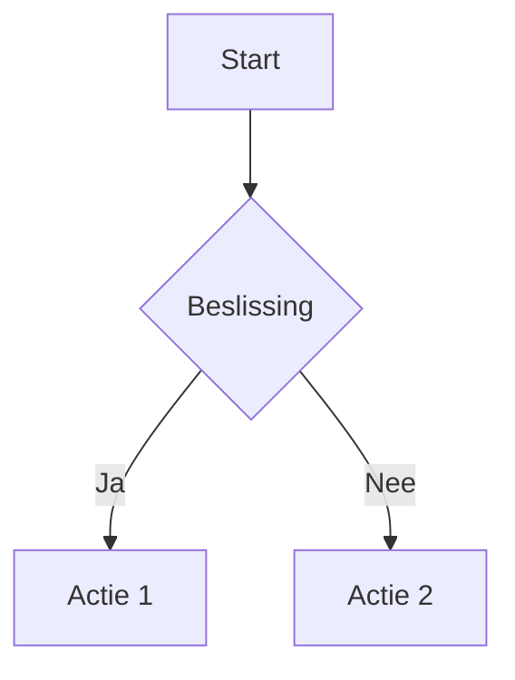

# DocToPdf

Een moderne .NET library en console applicatie voor het converteren van documenten (Markdown, HTML, DOCX, Text) naar PDF bestanden met ondersteuning voor Mermaid diagrammen en afbeeldingen. Inclusief dependency injection ondersteuning voor eenvoudige integratie in ASP.NET Core en andere .NET applicaties.

## 🏗️ Project Structuur

```
DocToPdf/
├── src/
│   ├── DocToPdf.Core/              # Core library met alle functionaliteit
│   ├── DocToPdf.Console/           # Console applicatie
│   ├── DocToPdf.Customization/     # PDF customization extensies
│   └── DocToPdf.Showcase/          # Web API showcase/demo
├── .scripts/                       # PowerShell helper scripts
├── .doc/                          # Project documentatie en voortgangsrapporten
├── test/                          # Test bestanden en voorbeelden
├── input/                         # Input bestanden voor console app
├── output/                        # Gegenereerde PDF bestanden
├── DocToPdf.sln                   # Solution file
└── README.md
```

## Features

✅ **Document Conversie**
- Markdown (.md) naar PDF
- HTML (.html) naar PDF  
- Word documenten (.docx) naar PDF
- Plain text naar PDF

✅ **Library & Console App**
- **NuGet Package**: Gebruik als library in je eigen projecten
- **Dependency Injection**: Eenvoudige integratie met ASP.NET Core
- **Console Application**: Standalone tool voor batch verwerking
- **Async Support**: Alle operaties zijn async voor betere performance

✅ **Geavanceerde Functionaliteiten**
- Automatische Mermaid diagram herkenning en conversie
- Afbeelding verwerking en optimalisatie (JPG, PNG, BMP, GIF, TIFF, WebP)
- Bulk conversie van alle bestanden in een directory
- Professional PDF layout met headers, footers en paginanummering
- Configureerbare opties via dependency injection

✅ **Gebruiksvriendelijk**
- Eenvoudige command-line interface
- Service interface voor programmatische toegang
- Automatische input/output directory management
- Gedetailleerde foutafhandeling en logging

## Vereisten

- .NET 8.0 of hoger
- Windows, macOS, of Linux

## Installatie

### Als NuGet Package

```bash
dotnet add package DocToPdf.Core
```

### Console App Builden

```bash
git clone https://github.com/YOUR_USERNAME/DocToPdf.git
cd DocToPdf
dotnet build
dotnet build
```

## Gebruik

### 🔧 Library Usage (Dependency Injection)

#### ASP.NET Core

```csharp
using DocToPdf.Core.Extensions;

var builder = WebApplication.CreateBuilder(args);

// Voeg DocToPdf services toe aan DI container
builder.Services.AddDocToPdf();

var app = builder.Build();
```

#### Controller Usage

```csharp
using DocToPdf.Core.Services;

[ApiController]
[Route("api/[controller]")]
public class PdfController : ControllerBase
{
    private readonly IDocumentToPdfService _pdfService;

    public PdfController(IDocumentToPdfService pdfService)
    {
        _pdfService = pdfService;
    }

    [HttpPost("html-to-pdf")]
    public async Task<IActionResult> ConvertHtmlToPdf([FromBody] HtmlRequest request)
    {
        var pdfBytes = await _pdfService.ConvertHtmlToPdfAsync(
            request.HtmlContent, 
            request.Title ?? "Generated PDF"
        );

        return File(pdfBytes, "application/pdf", $"{request.Title ?? "document"}.pdf");
    }

    [HttpPost("markdown-to-pdf")]
    public async Task<IActionResult> ConvertMarkdownToPdf([FromBody] MarkdownRequest request)
    {
        var pdfBytes = await _pdfService.ConvertMarkdownToPdfAsync(
            request.MarkdownContent, 
            request.Title ?? "Generated PDF"
        );

        return File(pdfBytes, "application/pdf", $"{request.Title ?? "document"}.pdf");
    }
}
```

#### Console App met DI

```csharp
using DocToPdf.Core.Extensions;
using DocToPdf.Core.Services;
using Microsoft.Extensions.DependencyInjection;
using Microsoft.Extensions.Hosting;

var host = Host.CreateDefaultBuilder(args)
    .ConfigureServices(services => services.AddDocToPdf())
    .Build();

var pdfService = host.Services.GetRequiredService<IDocumentToPdfService>();

// Convert HTML to PDF
var htmlContent = "<h1>Hello World</h1><p>This is a test.</p>";
var pdfBytes = await pdfService.ConvertHtmlToPdfAsync(htmlContent, "Test Document");
await File.WriteAllBytesAsync("test.pdf", pdfBytes);

// Convert Markdown to PDF
var markdownContent = "# My Document\nThis is **bold** text.";
await pdfService.ConvertMarkdownToPdfAsync(markdownContent, "markdown.pdf", "My Document");
```

### 📱 Console Application Usage

```bash
# Run via solution
dotnet run --project src/DocToPdf.Console/DocToPdf.Console.csproj [filename]

# Build and run executable
dotnet build
cd src/DocToPdf.Console/bin/Debug/net8.0
./DocToPdf.exe [filename]
# Converteer één specifiek bestand
dotnet run -- document.md

# Converteer alle ondersteunde bestanden in input/ directory  
dotnet run
```

### Directory Structuur

```
DocToPdf/
├── src/                           # Source code projecten
│   ├── DocToPdf.Core/            # Core library
│   ├── DocToPdf.Console/         # Console applicatie
│   ├── DocToPdf.Customization/   # PDF customization extensies
│   └── DocToPdf.Showcase/        # Web API showcase/demo
├── .scripts/                     # PowerShell helper scripts
│   ├── test.ps1                  # Test script
│   ├── clean.ps1                 # Project cleanup
│   ├── run.ps1                   # Build en run script
│   ├── create-image.ps1          # Image generation tests
│   ├── create-gif.ps1            # GIF generation tests
│   └── create-docx.ps1           # DOCX generation tests
├── .doc/                         # Project documentatie
│   ├── LIBRARY_EXAMPLES.md       # Uitgebreide library voorbeelden
│   ├── TECHNICAL_SPECIFICATIONS.md # Technische specificaties
│   └── ...                       # Voortgangsrapporten en documentatie
├── test/                         # Test bestanden en voorbeelden
│   ├── test.md                   # Markdown test bestand
│   ├── test-document.html        # HTML test bestand
│   ├── test-mermaid.md           # Mermaid diagram test
│   └── ...                       # Andere test bestanden
├── input/                        # Input bestanden voor console app
├── output/                       # Gegenereerde PDF bestanden
└── ...
```

### Ondersteunde Formaten

| Input Format | Extensions | Library Method | Beschrijving |
|-------------|------------|----------------|--------------|
| HTML        | `.html`    | `ConvertHtmlToPdfAsync()` | Met embedded afbeeldingen |
| Markdown    | `.md`      | `ConvertMarkdownToPdfAsync()` | Met Mermaid diagram ondersteuning |
| Word        | `.docx`    | `ConvertDocxToPdfAsync()` | Met afbeeldingen en tabellen |
| Plain Text  | `.txt`     | `ConvertTextToPdfAsync()` | Eenvoudige tekst conversie |

## Library API Reference

### IDocumentToPdfService Methods

```csharp
// HTML Conversion
Task<byte[]> ConvertHtmlToPdfAsync(string htmlContent, string title = "Generated PDF", string? basePath = null)
Task ConvertHtmlToPdfAsync(string htmlContent, string outputPath, string title = "Generated PDF", string? basePath = null)

// Markdown Conversion  
Task<byte[]> ConvertMarkdownToPdfAsync(string markdownContent, string title = "Generated PDF", string? basePath = null)
Task ConvertMarkdownToPdfAsync(string markdownContent, string outputPath, string title = "Generated PDF", string? basePath = null)

// Text Conversion
Task<byte[]> ConvertTextToPdfAsync(string textContent, string title = "Generated PDF")
Task ConvertTextToPdfAsync(string textContent, string outputPath, string title = "Generated PDF")

// DOCX Conversion
Task<byte[]> ConvertDocxToPdfAsync(string docxFilePath, string? title = null)
Task ConvertDocxToPdfAsync(string docxFilePath, string outputPath, string? title = null)
```

### Configuration Options

```csharp
builder.Services.AddDocToPdf(options =>
{
    options.DefaultOutputDirectory = "generated-pdfs";
    options.EnableMermaidDiagrams = true;
    options.DefaultPageSize = "A4";
    options.DefaultMargin = 50;
    options.MaxImageSizeBytes = 10 * 1024 * 1024; // 10MB
});
```

## Voorbeelden

### Markdown met Mermaid

```markdown
# Mijn Document



Dit wordt automatisch geconverteerd naar een professionele PDF met het diagram gerenderd als afbeelding.

### HTML met afbeeldingen

```html
<!DOCTYPE html>
<html>
<head><title>Test</title></head>
<body>
    <h1>Mijn Rapport</h1>
    
    <p>Beschrijving...</p>
</body>
</html>
```

### Service Usage in Blazor

```razor
@inject IDocumentToPdfService PdfService

<button @onclick="GeneratePdf">Generate PDF</button>

@code {
    private async Task GeneratePdf()
    {
        var content = "# Hello World\nThis is a **test** document.";
        var pdfBytes = await PdfService.ConvertMarkdownToPdfAsync(content, "My Document");
        
        // Download in browser
        var base64 = Convert.ToBase64String(pdfBytes);
        var dataUrl = $"data:application/pdf;base64,{base64}";
        await JSRuntime.InvokeVoidAsync("downloadFile", dataUrl, "document.pdf");
    }
}
```

## Scripts

Het project bevat handige PowerShell scripts in de `.scripts/` directory:

```powershell
# Test het project
.\.scripts\test.ps1

# Project cleanup
.\.scripts\clean.ps1

# Build en run met parameters
.\.scripts\run.ps1 input\document.md output\document.pdf
```

## Dependencies

Het project gebruikt de volgende NuGet packages:
- **QuestPDF** (PDF generatie)
- **HtmlAgilityPack** (HTML parsing)
- **DocumentFormat.OpenXml** (DOCX verwerking)  
- **PuppeteerSharp** (Mermaid rendering)
- **SixLabors.ImageSharp** (afbeelding verwerking)
- **Markdig** (Markdown parsing)
- **Microsoft.Extensions.*** (Dependency injection support)

## Ontwikkeling

### Project Structuur

```
DocToPdf/
├── Services/
│   ├── IDocumentToPdfService.cs    # Service interface
│   └── DocumentToPdfService.cs     # Service implementation
├── Extensions/
│   └── ServiceCollectionExtensions.cs # DI extensions
├── Converters/
│   ├── DocumentConverter.cs        # Document conversie logica
│   ├── ImageConverter.cs           # Afbeelding verwerking
│   └── MermaidConverter.cs         # Mermaid diagram rendering
├── Models/
│   └── PdfDocument.cs              # PDF generatie met QuestPDF
├── Program.cs                      # Console app entry point
└── DocToPdf.csproj                # Project configuratie (library + exe)
```

### NuGet Package Bouwen

```bash
dotnet pack --configuration Release
```

### Bouwen

```bash
dotnet build
dotnet test              # Als tests beschikbaar zijn
dotnet publish -c Release
```

## Integration Examples

Zie [LIBRARY_EXAMPLES.md](LIBRARY_EXAMPLES.md) voor uitgebreide voorbeelden van:
- ASP.NET Core Web API integratie
- Blazor Server/WASM usage  
- Background services
- Advanced configuration
- Performance tips

## Contributing

Bijdragen zijn welkom! Zie [CONTRIBUTING.md](CONTRIBUTING.md) voor richtlijnen.

1. Fork het project
2. Maak een feature branch (`git checkout -b feature/AmazingFeature`)
3. Commit je wijzigingen (`git commit -m 'Add some AmazingFeature'`)
4. Push naar de branch (`git push origin feature/AmazingFeature`)
5. Open een Pull Request

## Changelog

Zie [CHANGELOG.md](CHANGELOG.md) voor een overzicht van wijzigingen per versie.

## Licentie

Dit project is gelicenseerd onder de MIT License - zie het [LICENSE](LICENSE) bestand voor details.

## Acknowledgments

- [QuestPDF](https://github.com/QuestPDF/QuestPDF) voor PDF generatie
- [PuppeteerSharp](https://github.com/hardkoded/puppeteer-sharp) voor Mermaid rendering
- [HtmlAgilityPack](https://github.com/zzzprojects/html-agility-pack) voor HTML parsing
- [Markdig](https://github.com/lunet-io/markdig) voor Markdown verwerking

## Support

- 📖 [Documentatie](README.md)
- 🔧 [Library Examples](LIBRARY_EXAMPLES.md)
- 🐛 [Issues](https://github.com/YOUR_USERNAME/DocToPdf/issues)
- 💡 [Feature Requests](https://github.com/YOUR_USERNAME/DocToPdf/issues/new?template=feature_request.md)

---

**DocToPdf** - Professionele document naar PDF conversie voor .NET • Library & Console App
