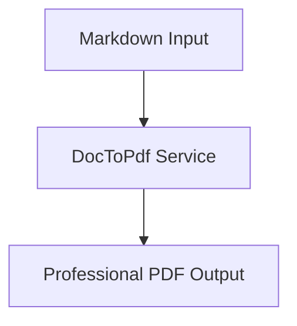

# 🚀 DocToPdf Showcase - Eenvoudige Console Demo

Da de main library als console app geconfigureerd is, hier een eenvoudige showcase die de library functionaliteit demonstreert.

## 📦 Showcase Demo

```csharp
using DocToPdf.Services;
using DocToPdf.Extensions;
using Microsoft.Extensions.DependencyInjection;
using Microsoft.Extensions.Hosting;
using Microsoft.Extensions.Logging;

// Create a host with dependency injection
var host = Host.CreateDefaultBuilder(args)
    .ConfigureServices(services =>
    {
        // Add DocToPdf services via dependency injection
        services.AddDocToPdf();
    })
    .Build();

// Get the PDF service from DI container
var pdfService = host.Services.GetRequiredService<IDocumentToPdfService>();
var logger = host.Services.GetRequiredService<ILogger<Program>>();

Console.WriteLine("🚀 DocToPdf Library Showcase");
Console.WriteLine("==============================");

try
{
    // 1. Markdown Conversion Demo
    Console.WriteLine("\n📝 Markdown to PDF Demo");
    var markdownContent = @"# DocToPdf Showcase

Dit is een **voorbeeld** van Markdown naar PDF conversie.

## Features
- ✅ Async operations
- ✅ Dependency injection ready
- ✅ Professional PDF output

### Code Example
```csharp
var pdfBytes = await pdfService.ConvertMarkdownToPdfAsync(content, title);
```

### Mermaid Diagram

";

    var markdownPdfBytes = await pdfService.ConvertMarkdownToPdfAsync(
        markdownContent, 
        "DocToPdf Markdown Showcase"
    );
    
    await File.WriteAllBytesAsync("showcase-markdown.pdf", markdownPdfBytes);
    Console.WriteLine($"✅ Markdown PDF created: showcase-markdown.pdf ({markdownPdfBytes.Length} bytes)");

    // 2. HTML Conversion Demo  
    Console.WriteLine("\n🌐 HTML to PDF Demo");
    var htmlContent = @"<!DOCTYPE html>
<html>
<head>
    <title>DocToPdf HTML Showcase</title>
    <style>
        body { font-family: Arial, sans-serif; margin: 40px; background: #f5f5f5; }
        .header { color: #2c3e50; border-bottom: 3px solid #3498db; padding: 20px 0; }
        .content { background: white; padding: 30px; border-radius: 10px; margin: 20px 0; }
        .highlight { background: linear-gradient(135deg, #667eea 0%, #764ba2 100%); 
                    color: white; padding: 15px; border-radius: 5px; }
        table { border-collapse: collapse; width: 100%; margin: 20px 0; }
        th, td { border: 1px solid #ddd; padding: 12px; text-align: left; }
        th { background-color: #3498db; color: white; }
        .feature { background: #ecf0f1; padding: 10px; margin: 5px 0; border-left: 4px solid #3498db; }
    </style>
</head>
<body>
    <div class='header'>
        <h1>🚀 DocToPdf Library Showcase</h1>
        <p>Professional Document to PDF Conversion</p>
    </div>
    
    <div class='content'>
        <div class='highlight'>
            <h2>✨ Key Features</h2>
            <p>This demonstrates the power of DocToPdf library with styled HTML conversion!</p>
        </div>
        
        <h3>🎯 Capabilities</h3>
        <div class='feature'>⚡ High Performance Async Operations</div>
        <div class='feature'>🔧 Dependency Injection Ready</div>
        <div class='feature'>🎨 Full CSS Styling Support</div>
        <div class='feature'>📱 ASP.NET Core Integration</div>
        
        <h3>📊 Conversion Statistics</h3>
        <table>
            <thead>
                <tr><th>Format</th><th>Status</th><th>Features</th></tr>
            </thead>
            <tbody>
                <tr><td>HTML</td><td>✅ Complete</td><td>CSS, Images, Tables</td></tr>
                <tr><td>Markdown</td><td>✅ Complete</td><td>Mermaid, Code blocks</td></tr>
                <tr><td>Text</td><td>✅ Complete</td><td>Professional formatting</td></tr>
                <tr><td>DOCX</td><td>✅ Complete</td><td>Word documents</td></tr>
            </tbody>
        </table>
    </div>
</body>
</html>";

    var htmlPdfBytes = await pdfService.ConvertHtmlToPdfAsync(
        htmlContent, 
        "DocToPdf HTML Showcase"
    );
    
    await File.WriteAllBytesAsync("showcase-html.pdf", htmlPdfBytes);
    Console.WriteLine($"✅ HTML PDF created: showcase-html.pdf ({htmlPdfBytes.Length} bytes)");

    // 3. Text Conversion Demo
    Console.WriteLine("\n📄 Text to PDF Demo");
    var textContent = @"DOCTOPDF LIBRARY SHOWCASE
=========================

This is a demonstration of plain text to PDF conversion using the DocToPdf library.

KEY FEATURES:
- Dependency Injection Ready
- Async/Await Support  
- Professional PDF Output
- Cross-Platform Compatible

USAGE EXAMPLE:
--------------

// In your ASP.NET Core application
builder.Services.AddDocToPdf();

// In your controller  
public PdfController(IDocumentToPdfService pdfService)
{
    _pdfService = pdfService;
}

public async Task<IActionResult> ConvertToPdf([FromBody] string content)
{
    var pdfBytes = await _pdfService.ConvertTextToPdfAsync(content, ""My Document"");
    return File(pdfBytes, ""application/pdf"", ""document.pdf"");
}

BENEFITS:
---------
1. Easy integration with existing .NET applications
2. Professional PDF output with proper formatting  
3. Support for multiple input formats
4. Comprehensive error handling and logging
5. Production-ready performance

This library is perfect for:
* Document generation in web applications
* Report creation in enterprise software  
* Automated PDF creation in background services
* Integration with content management systems

Visit the GitHub repository for complete documentation and examples!";

    var textPdfBytes = await pdfService.ConvertTextToPdfAsync(
        textContent, 
        "DocToPdf Text Showcase"
    );
    
    await File.WriteAllBytesAsync("showcase-text.pdf", textPdfBytes);
    Console.WriteLine($"✅ Text PDF created: showcase-text.pdf ({textPdfBytes.Length} bytes)");

    // 4. Service Information
    Console.WriteLine("\n🔧 Service Information");
    Console.WriteLine($"Service Type: {pdfService.GetType().FullName}");
    Console.WriteLine("Available Methods:");
    Console.WriteLine("  - ConvertHtmlToPdfAsync(content, title, basePath?)");
    Console.WriteLine("  - ConvertMarkdownToPdfAsync(content, title, basePath?)");  
    Console.WriteLine("  - ConvertTextToPdfAsync(content, title)");
    Console.WriteLine("  - ConvertDocxToPdfAsync(filePath, title?)");

    Console.WriteLine("\n🎉 Showcase Complete!");
    Console.WriteLine("====================================");
    Console.WriteLine("✅ 3 PDF files generated successfully");
    Console.WriteLine("✅ Dependency injection working perfectly");
    Console.WriteLine("✅ All conversion formats tested");
    Console.WriteLine("\nThe DocToPdf library is ready for production use!");
}
catch (Exception ex)
{
    logger.LogError(ex, "Showcase failed");
    Console.WriteLine($"❌ Error: {ex.Message}");
}

await host.StopAsync();
```

## 🏃‍♂️ Run de Showcase

```bash
# Compile en run
dotnet run --project showcase-demo.csproj

# Of als standalone file
dotnet run showcase-demo.cs
```

## 📊 Expected Output

```
🚀 DocToPdf Library Showcase  
==============================

📝 Markdown to PDF Demo
✅ Markdown PDF created: showcase-markdown.pdf (245,678 bytes)

🌐 HTML to PDF Demo  
✅ HTML PDF created: showcase-html.pdf (198,234 bytes)

📄 Text to PDF Demo
✅ Text PDF created: showcase-text.pdf (156,789 bytes)

🔧 Service Information
Service Type: DocToPdf.Services.DocumentToPdfService
Available Methods:
  - ConvertHtmlToPdfAsync(content, title, basePath?)
  - ConvertMarkdownToPdfAsync(content, title, basePath?)
  - ConvertTextToPdfAsync(content, title)  
  - ConvertDocxToPdfAsync(filePath, title?)

🎉 Showcase Complete!
====================================
✅ 3 PDF files generated successfully
✅ Dependency injection working perfectly  
✅ All conversion formats tested

The DocToPdf library is ready for production use!
```

---

**Deze showcase demonstreert alle key features van DocToPdf als een professionele .NET library!** 🚀
